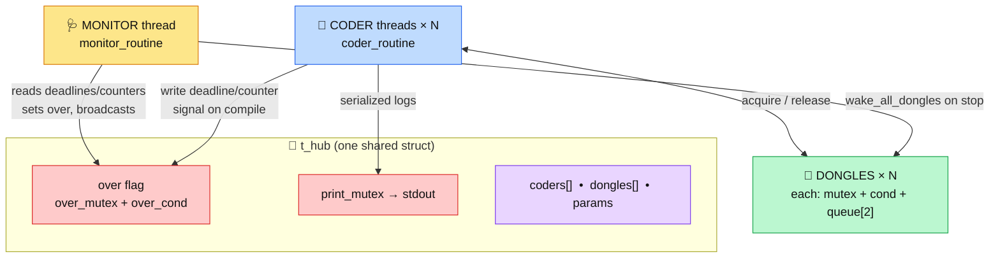
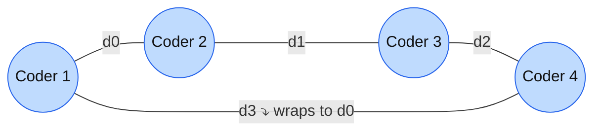
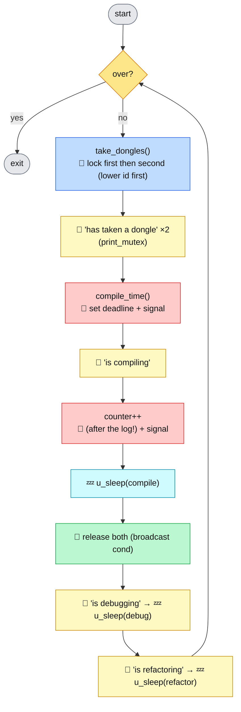
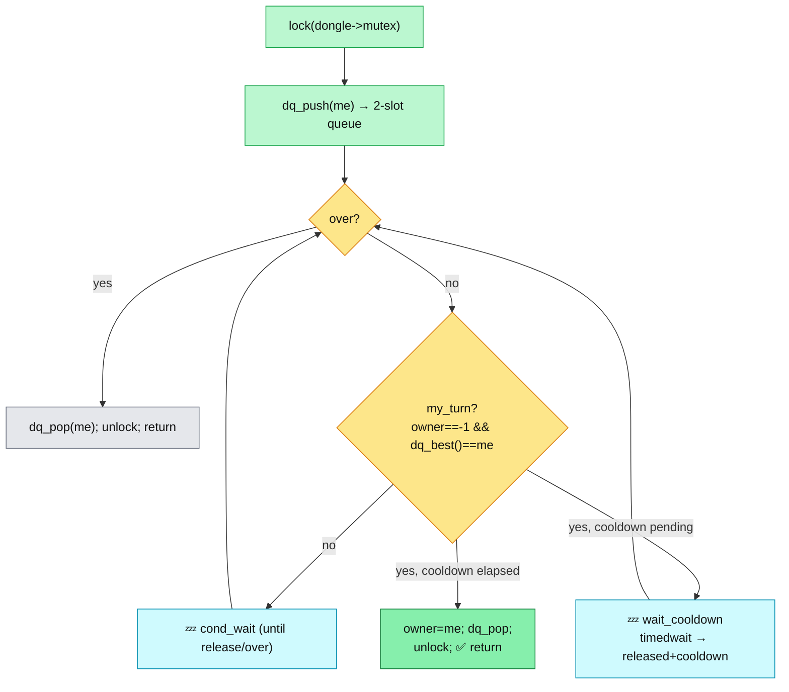
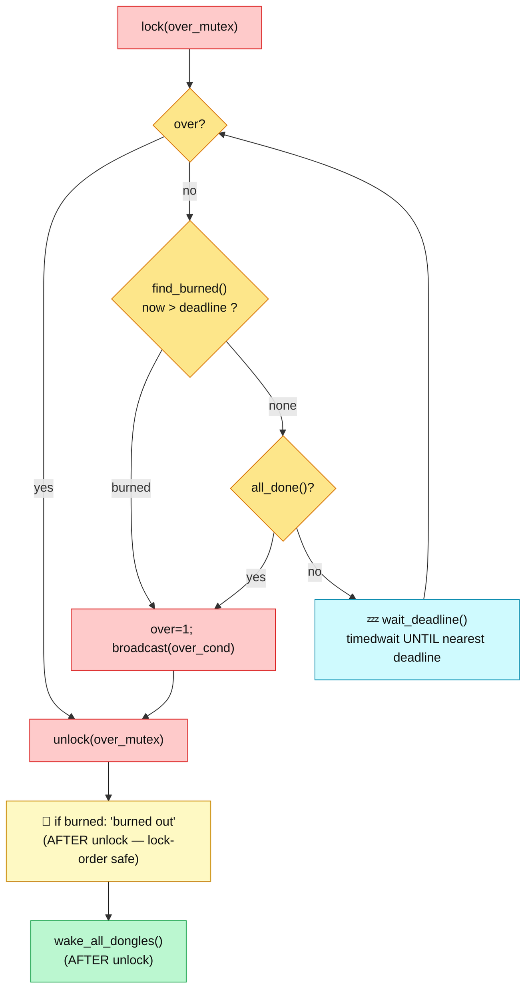
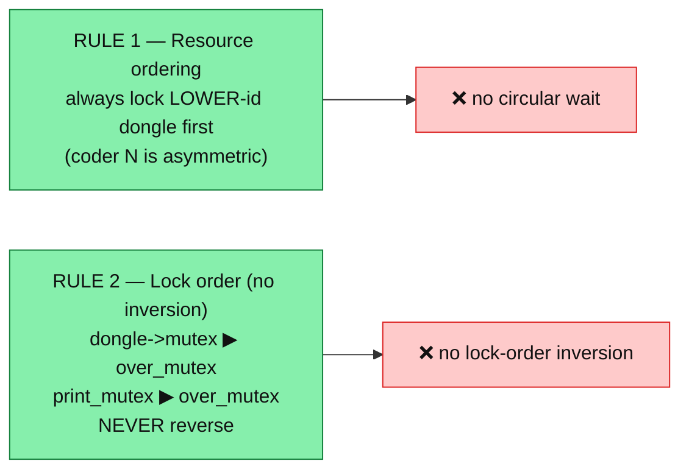
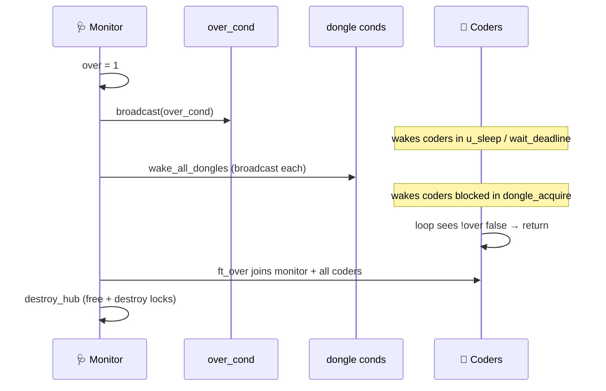

# 🧩 Codexion — Architecture & Synchronization Map


> A visual deep-dive into **every part** of the project: the threads, the data,
> and **every mutex / condition variable** — where it lives and **why**.

---

## 📑 Table of contents
1. [Big picture](#1--big-picture--threads--shared-state)
2. [The circular table](#2--the-circular-table)
3. [The three lock families](#3--the-three-lock-families)
4. [A coder's life](#4--a-coders-life)
5. [Dongle acquisition](#5--dongle-acquisition--arbitration--cooldown)
6. [The monitor](#6--the-monitor)
7. [Deadlock prevention](#7--deadlock-prevention)
8. [Shutdown](#8--shutdown)
9. [File & function map](#9--file--function-map)
10. [What was done](#10--summary--what-was-done)

---

## 1. 🗺️ Big picture — threads & shared state



> **Key idea:** `1 monitor + N coders`. **No** global server, **no** polling manager.
> Each dongle arbitrates its own (at most 2) waiters.

---

## 2. ⭕ The circular table



```c
/* init_coder():  dongles[i].id = i + 1 */
coder->right = &hub->dongles[id - 1];
coder->left  = &hub->dongles[id % hub->num_coders];
```

> 🔑 **`dongle[k]` is shared by EXACTLY 2 neighbours** (left of coder k, right of coder k+1).
> So a dongle can **never** have more than 2 waiters → a **2-slot queue is provably enough**.

---

## 3. 🔒 The three lock families

| 🔐 Lock | 📄 File | 🛡️ Protects | ❓ Why it exists |
|---|---|---|---|
| 🟢 `dongle->mutex` + `cond` | `dongles.c` | `owner`, `released`, `queue[2]` | Two neighbours grab the same dongle → must be exclusive *(subject: "protect each dongle with a mutex")*. Cond = wait for availability / cooldown. |
| 🔴 `over_mutex` + `over_cond` | `ft_over.c` / `monitor.c` | `over`, every `deadline`, every `counter` | Monitor **reads** deadlines/counters while coders **write** them. Cond = monitor sleeps to nearest deadline; coders sleep phases but wake instantly on `over`. |
| 🟡 `print_mutex` | `logtime.c` | `stdout` | *Subject: "two messages never interleave on a line."* |

---

## 4. 🧵 A coder's life



> ⚠️ **`counter++` happens AFTER `is compiling` is logged** so the printed log always
> matches the count (a compile can't "count" without being announced).

---

## 5. 🔌 Dongle acquisition — arbitration + cooldown



> 🏁 **`dq_best()`** — FIFO: smallest `arrived` • EDF: smallest `deadline` (tie → lower `id`).

---

## 6. 🩺 The monitor — precise, event-driven



> 💡 **Why `cond_timedwait`, not `usleep` polling?** It wakes **exactly** at the
> nearest deadline → catches every miss within timer latency (no 1ms poll gap to
> slip through), near-zero idle CPU, and a coder's compile-signal wakes it to
> notice completion immediately.

---

## 7. 🛡️ Deadlock prevention



> The monitor **releases `over_mutex`** before calling `loging()` or
> `wake_all_dongles()` (both take other locks) — that's what keeps Rule 2 intact.

---

## 8. 🛑 Shutdown



---

## 9. 🗃️ File & function map

> Norminette: **≤ 5 functions / file**, **≤ 25 lines / function**, no globals.

| 📄 File | 🔧 Functions | Role |
|---|---|---|
| `main.c` | `ft_codexion`, `fail_start`, `main` | spawn / join / cleanup |
| `parser.c` | `ft_parser`, `ft_check_params`, `is_number`, `ft_get_values` | argument validation |
| `init.c` | `ft_init_hub`, `destroy_hub`, `destroy_dongles`, `queue_free` | alloc / free |
| `coders.c` | `init_coder`, `compile_time`, `work_time`, `coder_routine` | coder lifecycle |
| `coder_utils.c` | `get_order`, `release_owned`, `take_dongles` | acquire helpers |
| `dongles.c` | `init_dongle`, `my_turn`, `wait_cooldown`, `dongle_acquire`, `dongle_release` | dongle + cooldown |
| `queue_utils.c` | `dq_push`, `dq_pop`, `winner`, `dq_best` | 2-slot priority queue |
| `monitor.c` | `wake_all_dongles`, `find_burned`, `all_done`, `wait_deadline`, `monitor_routine` | burnout/completion |
| `ft_over.c` | `ft_over`, `is_over`, `set_over` | join + over flag |
| `logtime.c` | `get_time_ms`, `loging`, `u_sleep` | clock / log / sleep |

---

## 10. ✅ Summary — what was done

| Area | Outcome |
|---|---|
| 🏗️ **Architecture** | Replaced global *server + manager* with **per-dongle arbitration** + single **monitor**. |
| 🎯 **Correctness** | Deadline = `last_compile_start + burnout`; `u_sleep` units; `counter++` after the log; interruptible sleeps; log-ordering race fixed; clean cleanup on `pthread_create` failure. |
| 🩺 **Precise monitor** | `cond_timedwait` to nearest deadline (not polling) → burnout caught precisely; fixed the `u_sleep` `while`-loop + strict `>` it exposed. |
| 🧪 **Concurrency** | ThreadSanitizer **0**, Helgrind **0** (+ `helgrind.supp` for glibc condvar false positive), Valgrind **0 leaks**. |
| 🧹 **Norm & hygiene** | norminette OK, ≤5 funcs/file, no globals, comments stripped, no relink. |
| 🛠️ **Tooling & docs** | `test_codexion.sh` (79 checks incl. INT_MAX/overflow), `CORRECTION.md`, this file, `helgrind.supp`. |
| 🧩 **Edge cases** | 1 coder, huge N / INT_MAX, zero work-times, huge cooldown, FIFO/EDF, `burnout≈cycle` boundary. |

> **Verified state:** build clean • norminette OK • **79/79** suite • TSan / Helgrind / Valgrind all **0**.
