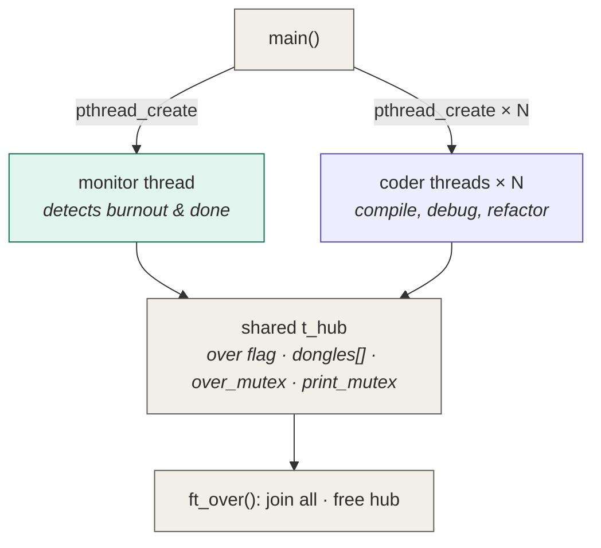

_This project has been created as part of the 42 curriculum by zhaouzan._

# Codexion

## Description

Codexion is a concurrency simulation built with POSIX threads. It models a group
of **coders** working in a shared hub, competing for a limited number of **USB
dongles**. Each coder repeatedly **compiles**, **debugs**, and **refactors**.
Compiling requires holding **two dongles at once** (a left and a right one). If a
coder waits too long between compiles, it **burns out** and the simulation stops.
The simulation also stops successfully once every coder has compiled a required
number of times.

The project is a variant of the classic Dining Philosophers problem, with two
added constraints: a **cooldown** on each dongle after it is released, and a
configurable **scheduling policy** (FIFO or EDF) that decides which waiting coder
is served next when several compete for the same dongle. A dedicated **monitor**
thread watches every coder and detects burnout precisely.



## Instructions

Compile with the provided Makefile:

```
make        # builds ./codexion
make clean  # removes object files
make fclean # removes objects and the binary
make re     # fclean + make
```

The program is compiled with `-Wall -Wextra -Werror -pthread`.

Run it with eight mandatory arguments:

```
./codexion number_of_coders time_to_burnout time_to_compile time_to_debug \
           time_to_refactor number_of_compiles_required dongle_cooldown scheduler
```

- `number_of_coders` — number of coders (and dongles).
- `time_to_burnout` (ms) — if a coder does not start a new compile within this
  time since its last compile (or the start), it burns out.
- `time_to_compile` (ms) — time spent compiling (two dongles held).
- `time_to_debug` (ms) — time spent debugging.
- `time_to_refactor` (ms) — time spent refactoring.
- `number_of_compiles_required` — once every coder reaches this count, the
  simulation ends successfully.
- `dongle_cooldown` (ms) — after release, a dongle cannot be retaken until this
  time has passed.
- `scheduler` — `fifo` or `edf`.

All arguments are validated before the simulation starts: non-integer values,
negative numbers, and any `scheduler` other than `fifo` or `edf` are rejected
with an error on `stderr` and a non-zero exit.

Example:

```
./codexion 3 800 100 50 50 2 10 edf
./codexion 1 200 100 50 50 3 10 edf      # single coder: burns out, cannot compile
```

State changes are logged as `timestamp_in_ms coder_id action`, with output
serialized so messages never interleave.

## Blocking cases handled

**Deadlock prevention (Coffman conditions).** A deadlock needs four conditions to
hold at once: mutual exclusion, hold-and-wait, no preemption, and circular wait.
Codexion breaks the **circular wait** condition through a fixed global lock
order: every coder acquires its two dongles in ascending dongle-id order (lowest
first), computed once in `get_order`. Because all coders follow the same order,
the cycle of "each holds one and waits for the next" can never form — at least
one coder always reaches for its dongles in the opposite direction.

**Starvation prevention / fair arbitration.** Each dongle keeps a small,
fixed-size waiter table (two slots — in the Dining Philosophers topology a dongle
sits between exactly two neighbouring coders, so at most two ever wait on it at
once). When a dongle becomes free, its next owner is chosen from the waiting
coders by the active policy: under FIFO the earliest arrival wins; under EDF the
earliest deadline wins, with the lower coder id as a deterministic tie-breaker. A
coder is granted the dongle only when it is the top-priority waiter (`my_turn`),
so no waiting coder is indefinitely overtaken.

**Cooldown handling.** After a dongle is released, its release timestamp is
recorded. A waiting coder may only acquire it once `dongle_cooldown` milliseconds
have elapsed since that release. When the cooldown is the only thing blocking an
otherwise-eligible coder, it sleeps precisely until the cooldown expires (via
`pthread_cond_timedwait`) rather than polling.

**Precise burnout detection.** A separate monitor thread tracks every coder's
deadline (`last_compile_start + time_to_burnout`). It polls on a short (1 ms)
interval and declares the first coder past its deadline as burned out, logging it
well within the required 10 ms window.

**Clean termination.** The simulation ends on exactly one of two events: every
coder has compiled the required number of times (success), or a coder burns out
(failure). On either event the monitor sets a shared `over` flag and wakes every
coder blocked on a dongle, so all threads observe the end, leave their queues,
and join cleanly with no hang and no leaked memory.

**Log serialization.** All output passes through a single print mutex, so two
state messages never interleave on one line.

## Thread synchronization mechanisms

**Primitives used.** The project uses `pthread_mutex_t` and `pthread_cond_t`
only (no global variables). Each dongle has its own mutex and condition variable;
the hub has an `over_mutex` guarding the shared `over` flag and the coders'
`deadline`/`counter` fields, and a `print_mutex` serializing output.

**Per-dongle mutex + condition variable.** A dongle's mutex protects its state
(`owner`, `released`, and its waiter table). A coder acquiring a dongle holds
this mutex while it checks whether it may take the dongle and while it waits, so
the check-and-wait is atomic. The condition variable lets a waiting coder sleep
instead of busy-looping; on release, the holder broadcasts to wake all waiters so
the top-priority one can proceed.

**Avoiding lost and spurious wakeups.** Waiting always uses the pattern "hold the
mutex, check the condition in a loop, and wait with the mutex held."
`pthread_cond_wait` and `pthread_cond_timedwait` release the mutex only while
actually sleeping and re-acquire it on waking. This closes the race where a
release could happen in the gap between a coder's check and its sleep. Because the
check is a `while` loop, after every wake the coder re-checks the real state
rather than trusting the wakeup, which also handles spurious wakeups. The project
uses `pthread_cond_broadcast` (not `signal`) so no waiter is ever left behind.

**Coder–monitor communication.** Coders and the monitor share state through the
hub under `over_mutex`. A coder updates its `deadline` and `counter` under this
mutex when it compiles; the monitor reads those same fields under the same mutex
(in `find_burned` and `all_done`). Because every cross-thread read and write of a
shared field goes through one common lock, there is no data race between coders
and the monitor. (A coder also reads its *own* `deadline` when enqueuing itself,
but that read is on the same thread that writes it, so it is not a race.) The
monitor's main loop holds no lock — each of its helpers takes `over_mutex` only
briefly — so the monitor never blocks the coders while it runs.

**Lock-ordering safety.** Two lock classes exist: the per-dongle mutexes and the
hub's `over_mutex`. They are sometimes held nested — while a coder waits inside
`dongle_acquire` it holds that dongle's mutex and briefly takes `over_mutex`
through `is_over` — but always in the **same order**: dongle mutex first, then
`over_mutex`. No path ever takes them the other way round: `set_over`,
`find_burned`, `all_done` and `compile_time` take `over_mutex` while holding no
dongle mutex, and the shutdown wake (`wake_all_dongles`) takes dongle mutexes
while holding no `over_mutex`. A single consistent acquisition order means there
is no lock-ordering cycle, so the added synchronization cannot itself deadlock.

## Technical choices

**Two-slot waiter table instead of a generic heap.** Because each dongle is
shared by exactly two neighbouring coders, its waiter table never holds more than
two entries. The next-owner selection (`dq_best` / `winner`) therefore compares
at most two waiters in O(1), and a general heap would add code and complexity
with no functional benefit at this contention level.

## Resources

- The Dining Philosophers problem (E. W. Dijkstra, EWD-310, *Hierarchical
  Ordering of Sequential Processes*) — the origin of resource ordering as a
  deadlock fix, used here in `get_order`.
- Coffman, Elphick, Shoshani — the four necessary conditions for deadlock.
- *Operating Systems: Three Easy Pieces* (Arpaci-Dusseau), free at
  <https://pages.cs.wisc.edu/~remzi/OSTEP/> — chapters on Locks, Condition
  Variables, and Common Concurrency Problems.
- *The Little Book of Semaphores* (Allen B. Downey), free at
  <https://greenteapress.com/wp/semaphores/> — classic synchronization problems,
  including Dining Philosophers.
- LLNL POSIX Threads Programming tutorial —
  <https://hpc-tutorials.llnl.gov/posix/> — practical pthreads reference for
  mutexes and condition variables.
- *Programming with POSIX Threads* (David R. Butenhof) — the predicate-loop /
  condition-variable pattern in depth.
- POSIX Threads man pages — `pthread_create`, `pthread_mutex_lock`,
  `pthread_cond_wait`, `pthread_cond_timedwait`, `pthread_cond_broadcast`; the
  `pthread_cond_wait` page is the authority on the mandatory predicate loop and
  spurious wakeups.
- Tooling — Valgrind (Helgrind/DRD) and ThreadSanitizer were used to verify the
  absence of data races, lock-ordering violations, and memory leaks.
